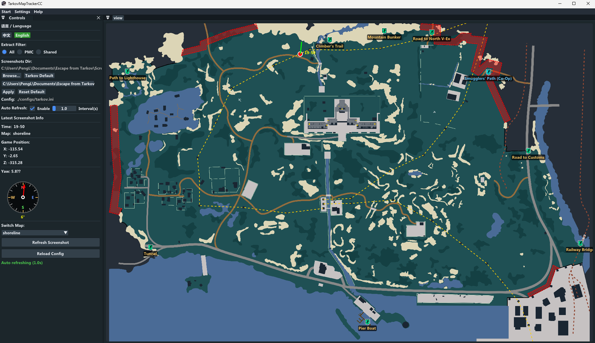

## TarkovMapTrackerCC
A tool for Escape from Tarkov that automatically parses game screenshots and displays player position and orientation on the map.

## build for win

ENV: Visual Studio 2022

```
mkdir build && cd build
cmake ..
MSBuild.exe TarkovMapTrackerCC.sln -t:Rebuild -p:Configuration=Release
```

## demo



## Configuration

Edit `./configs/tarkov.ini`:

```ini
[Paths]
ScreenshotsDir = ./res/screenshots #example  C:\Users\PengL\Documents\Escape from Tarkov\Screenshots
MapsDir = ./res/maps
IconsDir = ./res/icons
MapDataJson = ./res/maps/maps.json

[UI]
SelectedMap = shoreline
ExtractFilter = 0          # 0:All 1:PMC 2:Shared
Language = Chinese         # English or Chinese

[AutoRefresh]
Enabled = false            # Enable auto-refresh
Interval = 5.0             # Refresh interval (seconds)
```

## Thanks

[TarkovMapTracker](https://github.com/M4elstr0m/TarkovMapTracker.git)
